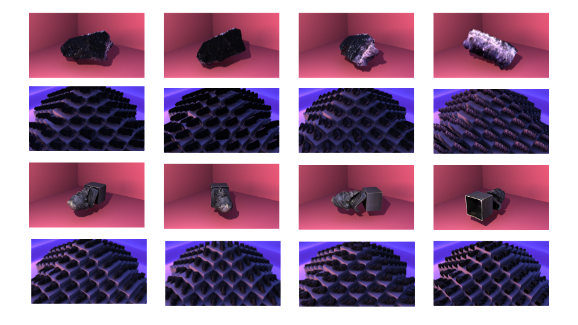

# Mayapy-template-render-2021
This is a python script meant to be run in mayapy to automatically process and render a directory full of separate zipped folders containing 3D objects. Specifically, it unzips the folder, imports the object to maya, orients the object in the scene, sets up the textures to be renderable by Arnold, then renders and saves the image. The script parses through all zipped folders in the directory for as many template scene files as were provided.

Currently this script is just showing off what I got working in my own personal direcotry. There is some work to do if I decide to make this a more functional command line tool that doesn't depend so heavily on hardcoded directory paths and the exisence of certain objects in the template files.

### WARNING! Make sure zipped folders of objects are in a clean directory!
As a cleanup step I remove all non-zip files and folders in the same directory as the zips to save space when the script is run.

Here's a look at the kinds of renders I was able to make using this script (objects are public domain museum scan models, see https://sketchfab.com/blogs/community/sketchfab-launches-public-domain-dedication-for-3d-cultural-heritage/) :

